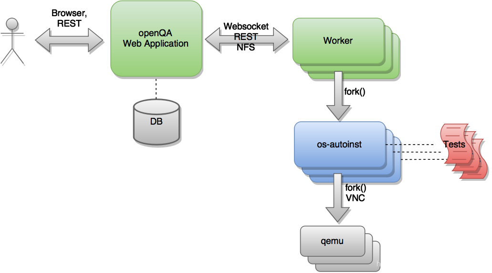

# openQA框架调研

### 什么是openQA

openQA 是一个测试框架，允许您一方面测试 GUI 应用程序，另一方面测试引导加载程序和内核。在这两种情况下，都很难编写测试脚本和验证输出。输出可以是弹出窗口，也可以是早期引导中的错误，这个早期甚至在执行 init 之前。

### openQA的架构



上面是openQA的架构图，其中openQA Web Application是UI端，他可以保存测试结果到数据库，UI端和Worker端通过websocket等方式连接，而worker的主要作用是启动后端代码os-autoinst,后端代码会启动虚拟机并且开始运行测试代码。具体的解释如下：

测试引擎的核心是一个名为“os-autoinst”（蓝色）的独立应用程序。在每次执行中，此应用程序都会创建一个虚拟机并使用它来运行一组测试脚本（红色）。 “os-autoinst”生成视频、屏幕截图和包含详细结果的 JSON 文件。

另一方面，“openQA”（绿色）提供基于 Web 的用户界面和基础架构，以分布式方式运行“os-autoinst”。 Web 界面还提供了一个基于 JSON 的类似 REST 的 API，用于外部脚本编写和工作程序使用。工作人员从 openQA 获取数据和输入文件，供 os-autoinst 运行测试。一个主机系统可以运行多个 worker。 openQA Web 应用程序负责在工作人员之间分配测试工作。 Web 应用程序和 worker 可以在同一台机器上运行，也可以在同一网络或分布式的多台机器上通过网络连接。在云中运行 Web 应用程序和worker是完全可能的。

### openQA测试的范围

openQA 最初是 openSUSE 自动化测试计划的一个自动化测试框架。主要用于测试**操作系统的安装过程和GUI应用程序**。

openQA最重要的特点之一是，它可以用来**测试几种操作和配置的组合**。对于这些组合中的每一个，系统都会创建一个虚拟机，执行某些步骤并返回一个整体结果。这些执行中的每一个都被称为 "作业"。每个作业都有一个数字标识符，并有几个相关的 "设置 "来驱动其行为。

### 使用openQA测试的发行版Linux

openQA最初用于openSUSE，后来fedora和SLE也有使用。

openSUSE和SLE上的测试套和预计结果，[仓库链接](https://github.com/os-autoinst/os-autoinst-distri-opensuse)

### openQA的执行教程

本部分主要参考如下教程：[openqa快速start教程GitHub链接](https://github.com/os-autoinst/openQA/blob/master/docs/GettingStarted.asciidoc)

#### 写在前面

开始使用 openQA 的一种简单方法是开始测试 openSUSE 或 Fedora，因为它们已设置好一切并准备好简化初始部署。当然如果想要了解更多，你可以从头开始手动配置整个 openQA。

#### 获取tests和needles

首先你需要获得实际的测试。你可以从GitHub上获得openSUSE的测试和针头（预期结果）。它属于/var/lib/openqa/tests/opensuse目录。可以通过执行以下命令更快完成：

```
/usr/share/openqa/script/fetchneedles
```

这将会把测试下载到正确的位置，也会设置正确的权限。

Fedora的测试也在Git中。要使用它们，您可能会这样做：

```
cd /var/lib/openqa/share/tests
mkdir fedora
cd fedora
git clone https://pagure.io/fedora-qa/os-autoinst-distri-fedora.git
./templates --clean
cd ..
chown -R geekotest fedora/
```

#### 获取 openQA 配置

要配置所有内容以实际运行测试，可以在管理界面中设置很多选项。如果您打算使用上一节中提到的测试来测试 openSUSE Factory，最简单的入门方法是使用以下命令：

```
/var/lib/openqa/share/tests/opensuse/products/opensuse/templates [--apikey API_KEY] [--apisecret API_SECRET]
```

这将加载在 openSUSE production openQA 的某个时间点使用的一些默认设置。因此，这些应该与 openSUSE 测试和针头一起工作得相当好。此脚本使用 /usr/share/openqa/script/openqa-load-templates，请考虑阅读其帮助页面 (--help) 以获取有关可能的额外参数的文档。

对于 Fedora，类似地，您可以调用：

```
/var/lib/openqa/share/tests/fedora/templates [--apikey API_KEY] [--apisecret API_SECRET]
```

一些 Fedora 测试需要特殊的硬盘映像出现在 /var/lib/openqa/share/factory/hdd/fixed 中。 createhdds 存储库中的 createhdds.py 脚本可用于创建这些。有关详细信息，请参阅该存储库中的文档。

#### 添加新的 ISO 进行测试

要开始测试新的 ISO，请将其放入 /var/lib/openqa/share/factory/iso 并调用以下命令：

```
# Run the first test
openqa-cli api -X POST isos \
         ISO=openSUSE-Factory-NET-x86_64-Build0053-Media.iso \
         DISTRI=opensuse \
         VERSION=Factory \
         FLAVOR=NET \
         ARCH=x86_64 \
         BUILD=0053
```

如果您的 openQA 未在“localhost”上的端口 80 上运行，您可以添加选项 --host=http://otherhost:9526 以指定不同的端口或主机。

**注意：**在“客户端”命令中仅使用 ISO 文件名。您必须将该文件放在 /var/lib/openqa/share/factory/iso 中。您不能将文件放在别处并在命令中指定其路径。但是，openQA 还支持从受信任域远程下载资产的功能。

对于 Fedora，示例运行可能是：

```
# Run the first test
openqa-cli api -X POST isos \
         ISO=Fedora-Everything-boot-x86_64-Rawhide-20160308.n.0.iso \
         DISTRI=fedora \
         VERSION=Rawhide \
         FLAVOR=Everything-boot-iso \
         ARCH=x86_64 \
         BUILD=Rawhide-20160308.n.0
```

### 更多参考链接

- [openQA官方文档链接](http://open.qa/documentation/)
- [openQA官方GitHub组织链接](https://github.com/os-autoinst)

