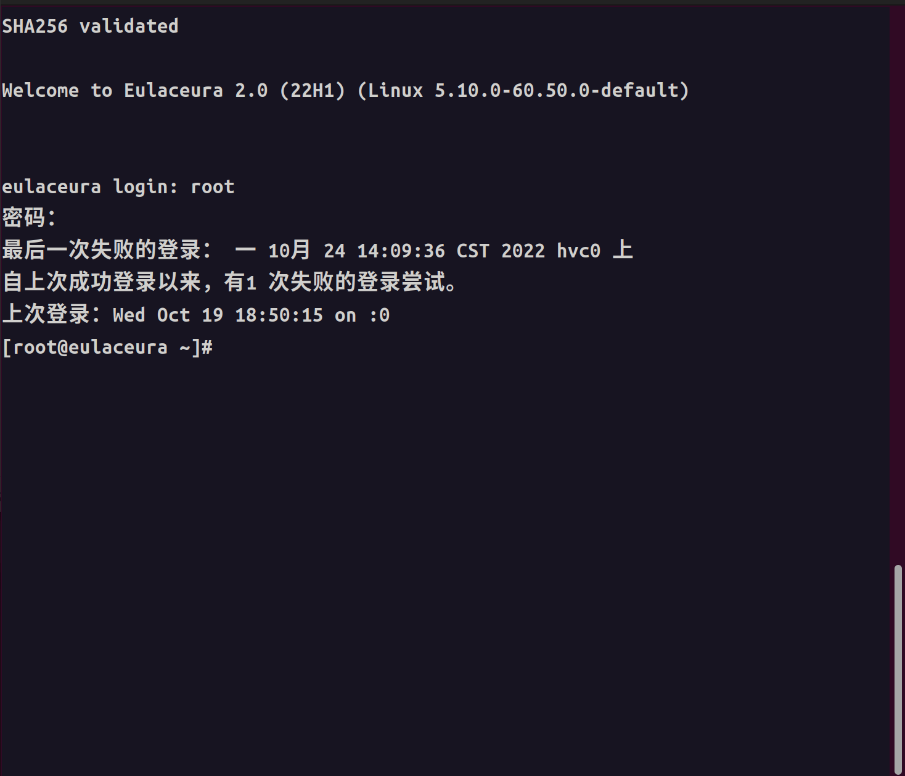
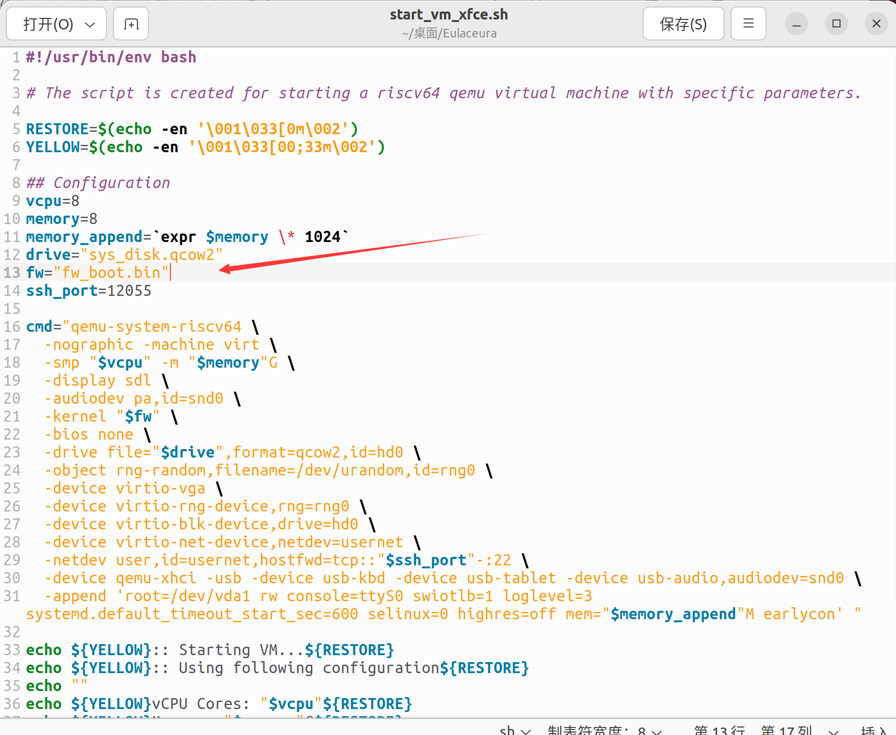
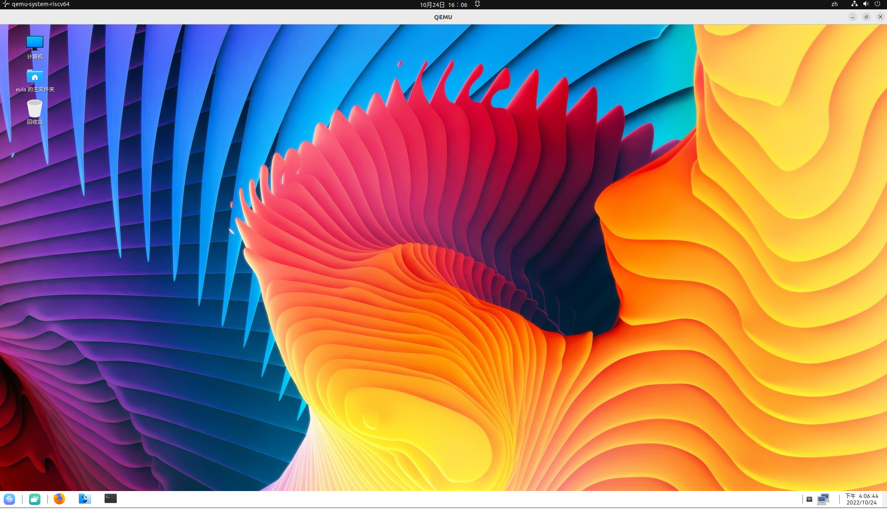

# eulaceura 22H1系统的启动与配置

## 命令行版本

#### 下载镜像

- 首先下载镜像，下载地址为：[eulaceura 22H1](https://repo.tarsier-infra.com/eulaceura/image/22H1/)

- 之后解压`Eulaceura-22H1-Desktop_vm.qcow2.xz`文件

#### 启动系统

- 这里使用`bash start_system.sh`命令启动镜像，但是在**实际执行时有一定问题**，需要进行修改

- 错误原因为，该文件的第6行指定的文件名字，与镜像的文件名字不一致。解决方案为修改sh文件或者修改镜像文件名，本次采用后者，将qcow2文件名字改为`sys_disk.qcow2`
- 之后使用`bash start_system.sh`命令

- 账号密码有如下两组
  - root   Eulaceura12#$
  - eula   ceura

- 启动系统，截图如下

  

## desktop版本

- 由于目前开发没有给出现成的桌面版本启动文件，我们使用openEuler系统的文件进行修改，之后启动desktop版本。

#### 修改openEuler系统的start_vm_xfce.sh文件

- 这里主要是修改映碟指向和引导指向，即start_vm_xfce.sh文件的第12行和13行。截图如下

  

- 修改后的文件也已经上传在本文件的同级文件夹

#### 启动系统

- 使用命令`bash start_vm_xfce.sh`命令即可启动系统

- 这里速度可能比较慢，要耐心等待

- 启动后截图如下

  
  
  