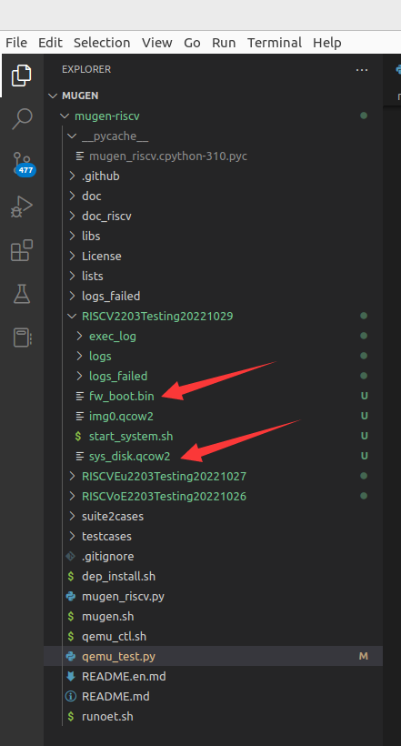
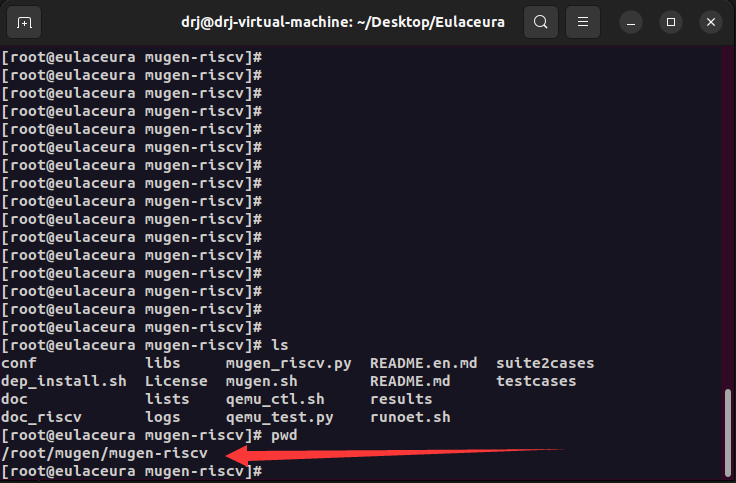

# eulaceura上自动化测试脚本的配置和使用教程

### 前置知识

进行多线程自动化测试脚本的配置和使用之前，建议首先学习以下知识：

- [mugen在eulaceura系统上的配置使用](https://github.com/renjiedai/PLCT_TEST/blob/master/WEEK2_20221024-20221030/mugen%E5%9C%A8eulaceura%E7%B3%BB%E7%BB%9F%E4%B8%8A%E7%9A%84%E9%85%8D%E7%BD%AE%E4%BD%BF%E7%94%A8.md)
- [openEuler系统上自动化测试脚本的基本知识](https://github.com/brsf11/mugen-riscv/tree/riscv/doc_riscv/Markdown)

### 环境配置

- 首先`git clone` 等操作步骤和之前一样，不再赘述

- 在当前目录下新建一个文件夹，内含.qcow2、启动程序等文件；同时这也是测试结果的输出目录。该部分的文件结构如下所示

  

- 之后是修改qemu_test.py脚本的一些内容

### 修改qemu_test.py脚本

脚本主要修改以下几个地方：

- 文件启动目录：在main函数里最初获取参数的地方，`parser.add_argument('-w',type=str,default='xxx',help='Specify working directory')`将xxx的位置换成上边新建的文件目录，或者输入命令的时候指定

- eulaceura系统的mugen位置：`parser.add_argument('-d',type=str,default='xxx',help='Specity mugen installed directory')`，这里xxx修改为eulaceura系统里mugen脚本的位置（注意是eulaceura虚拟机里mugen的位置，不是Ubuntu里的位置）

  

- 建议自己运行时这里的地址使用绝对路径，防止后续cd跳转时出错

### 执行命令启动多线程测试程序

执行以下命令，即可运行该脚本。注意这里新加了-o的参数来选择当前使用的操作系统。

`python3 qemu_test.py -l lists/list_riscv -x 3 -o eulaceura -b sys_disk.qcow2 -g`
