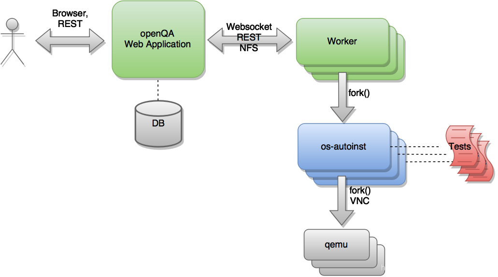

# openqa框架调研

### openqa的架构

上面是openQA的架构图，其中openQA Web Application是UI端，他可以保存测试结果到数据库，UI端和Worker端通过websocket等方式连接，而worker的主要作用是启动后端代码os-autoinst,后端代码会启动虚拟机并且开始运行测试代码。具体的解释如下：

测试引擎的核心是一个名为“os-autoinst”（蓝色）的独立应用程序。在每次执行中，此应用程序都会创建一个虚拟机并使用它来运行一组测试脚本（红色）。 “os-autoinst”生成视频、屏幕截图和包含详细结果的 JSON 文件。

另一方面，“openQA”（绿色）提供基于 Web 的用户界面和基础架构，以分布式方式运行“os-autoinst”。 Web 界面还提供了一个基于 JSON 的类似 REST 的 API，用于外部脚本编写和工作程序使用。工作人员从 openQA 获取数据和输入文件，供 os-autoinst 运行测试。一个主机系统可以运行多个 worker。 openQA Web 应用程序负责在工作人员之间分配测试工作。 Web 应用程序和 worker 可以在同一台机器上运行，也可以在同一网络或分布式的多台机器上通过网络连接。在云中运行 Web 应用程序和worker是完全可能的。

### openqa测试的范围

openQA 最初是 openSUSE 自动化测试计划的一个自动化测试框架。主要用于测试**操作系统的安装过程和GUI应用程序**。

openQA最重要的特点之一是，它可以用来**测试几种操作和配置的组合**。对于这些组合中的每一个，系统都会创建一个虚拟机，执行某些步骤并返回一个整体结果。这些执行中的每一个都被称为 "作业"。每个作业都有一个数字标识符，并有几个相关的 "设置 "来驱动其行为。

### 使用openqa测试的发行版Linux

openQA最初用于openSUSE，后来fedora和SLE也有使用。

openSUSE和SLE上的测试套和预计结果，[仓库链接](https://github.com/os-autoinst/os-autoinst-distri-opensuse)